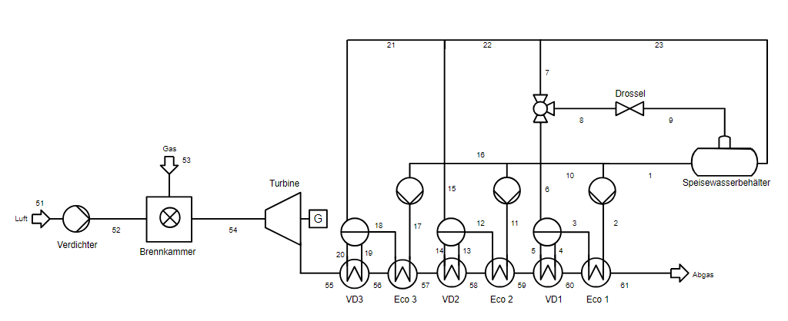

<h1>Gruppenarbeit Gruppe-4 </h1>

## Ziel
Im Rahmen des Moduls "Vertiefendes Rechnerpraktikum zur Energietechnik" besteht das Hauptziel darin, einen industriellen Dampferzeugungsprozess zu entwerfen, zu modellieren und zu simulieren. Ein spezieller Fokus liegt auf der Überprüfung des theoretischen Gasverbrauchs für drei unterschiedliche Varianten des Prozesses. Die Semesteraufgabe stellt konkrete Anforderungen an die Erzeugung und Distribution von Sattdampf: Es sollen Hochdruckdampf (40 bar, 90 t/h), Mitteldruckdampf (14 bar, 360 t/h) und Niederdruckdampf (4 bar, 900 t/h) bereitgestellt werden. Für eine effiziente Dampfverteilung im Netzwerk ist zusätzlich ein Druckverlust von 1 bar für jede Variante zu berücksichtigen.
> [!NOTE]
> Für mehr Informationen über den Aufbau unseres Modells besuchen Sie gerne unsere [Internetwebseite](https://kdh981.github.io/RET-Gruppe-4/).

## Installation
TESPy steht für Thermal Engineering Systems in Python und ist eine Bibliothek zur Simulation und Berechnung thermodynamischer Kreisläufe und Prozesse. Sie ermöglicht Anwendern, maßgeschneiderte Lösungen für komplexe energietechnische Systeme wie Kraftwerke und Wärmepumpen zu entwickeln, indem sie eine flexible und intuitive Modellierungsumgebung bietet. Für eine funktionierende Modellierung eines Dampferzeugers ist TESPy erforderlich. Dafür muss TESPy mit folgendem Befehl installiert werden:

> [!TIP]
> Essenziell für die Funktionsfähigkeit des Modells:
```bash
pip install tespy
```
CoolProp ist eine Python-Bibliothek, die genaue Daten über thermodynamische Eigenschaften verschiedener Stoffe liefert. Sie ist besonders nützlich für Ingenieure, Wissenschaftler und studierende in verschiedenen Bereichen, wie Kraftwerkstechnik, Klimatechnik und Verfahrenstechnik, da sie umfassende Informationen für die Modellierung von Prozessen und die Analyse von Stoffeigenschaften bietet. Zur Modellbildung muss CoolProp installiert werden:

> [!TIP]
> Essenziell für die Funktionsfähigkeit des Modells:
```bash
pip install CoolProp
```

## Modell: Dampferzeuger
### Fließbild
Hier sehen Sie die Abbildung des einfach modellierten Dampferzeugers, der die Dampferzeugung rein über Gasverbrennung ermöglicht:



## Ergebnis
Das Ziel ist die Erstellung eines funktionierenden Modells mit TESPy, um drei verschiedene Varianten zu betrachten und festzustellen, welche theoretisch den niedrigsten Gasverbrauch aufweist. Das Modell gibt in Tabellenform die benötigten Informationen wieder. Welches Modell den niedrigsten Gasverbrauch aufweist, können Sie auf unserer [Internetwebseite](https://kdh981.github.io/RET-Gruppe-4/) nachlesen.

## Ausblick
Es sind weitere Verbesserungen des Codes möglich, um ein genaueres Modell zu erstellen. Einige Verbesserungsmöglichkeiten sind:

### Dynamische Betrachtung
Eine dynamische Betrachtung könnte zu realistischeren Ergebnissen führen, da die bereits erstellten Modelle einige Vereinfachungen beinhalten. Diese umfassen unter anderem die Annahme konstanter Umgebungs-, Kühlwasser- und Erdgastemperaturen sowie die Prämisse, dass immer ein konstanter Abnehmer des produzierten Dampfes vorhanden ist.

### Zukünftige Entwicklungen
Für die Zukunft könnten weitere Integrationen moderner und erneuerbarer Technologien modelliert werden, um einen industriellen Dampferzeugungsprozess zu entwerfen, der unabhängig von fossilen Brennstoffen operiert. 

### Elektrifizierung
Interessant könnte die Betrachtung der Elektrifizierung des Dampferzeugers sein, unter dem Motto „Power to Heat“. Die Einbindung verschiedener erneuerbarer Energien und eines Elektroheizstabes könnte eine interessante Möglichkeit sein, den Gasverbrauch auf null zu reduzieren, während realistische Werte für den Strommarktpreis im Modell verwendet werde


