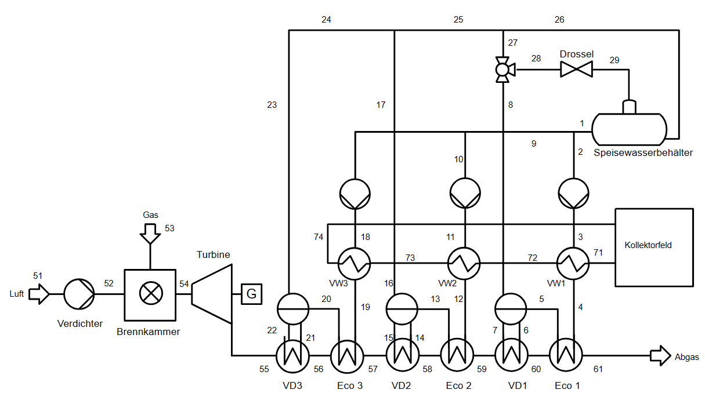

<!-- <!DOCTYPE html> -->
<html lang="de">
<head>
    <meta charset="UTF-8">
    <meta name="viewport" content="width=device-width, initial-scale=1.0">
    <title>Gruppenarbeit Gruppe-4</title>
    <!-- Verknüpfung mit der CSS-Datei -->
    <link rel="stylesheet" href="styles.css">

</head>
<body>
    <!-- Kopfbereich der Webseite -->
    <header>
        

            <h1>Gruppenarbeit Gruppe-4 </h1>
            <!-- Navigationsleiste -->
            <nav>
                <ul>
                    <li><a href="#einleitung">Einleitung und Aufgabenstellung</a></li>
                    <li><a href="#modell">Aufbau des Modells</a></li>
                    <li><a href="#ergebnisse">Ergebnisse</a></li>
                    <li><a href="#ausblick">Ausblick</a></li>
                </ul>
            </nav>
        

    </header>

    <!-- Hauptinhalt -->
    

        <!-- Einleitungsbereich -->
        <section id="einleitung">
            <h2>Einleitung und Aufgabenstellung</h2>
            
Für das Modul Vertiefendes Rechnerpraktikum zur Energietechnik ist das Ziel, einen industriellen Dampferzeugungsprozess zu entwerfen, modellieren und zu simulieren. Dafür wird das Programm <em>TESPy</em> und <em>Ebsilon</em> verwendet.

            
In der Grundvariante nutzt der modellierte Dampferzeuger Erdgas und verbrennt diese in einer Brennkammer, um die benötigten Dampfstufen zu erreichen. Es ist eine Gasturbine zwischen der Brennkammer und den Wärmetauscher geschaltet, um elektrische Energie zu erzeugen und die hohen Temperaturen der Abwärme sinnvoll zu nutzen. In weiteren Modellen wird eine Einbindung einer Wärmepumpe sowie solarthermischer Energie betrachtet und diskutiert, ob dies eine sinnvolle Möglichkeit ist, den CO&#8322;-Ausstoß zu reduzieren.

        </section>

        <!-- Aufbau des Modells -->
        <section id="modell">
            <h2>Aufbau des Modells</h2>
           
           
Für das einfachste Modell mit reiner Erdgasverbrennung wird eine schematische Darstellung in Abbildung 1 präsentiert. Hier ist der Aufbau zu erkennen, an dem sich die Modellierungen orientieren. Für <em>Ebsilon Professional</em> wird dieser Aufbau übertragen, da es hauptsächlich eine graphische Oberfläche für den Aufbau des Modells nutzt. Es müssen noch Regler und Startwerte ergänzt werden, um das Modell zu vervollständigen. Hierdurch wird ein voll funktionsfähiges Modell zur Berechnung des Gasverbrauchs ermöglicht. 

  <figcaption class="caption-class">Abbildung 1: Fließbild für das Modell 1 mit reiner Erdgasverbrennung.</figcaption> 
 

   <!-- Absatnd zum Text unten -->
 

Auf der anderen Seite wiederum steht das Modell in <em>TESPy</em> (<em>engl.: Thermal Engineering Systems in Python</em>), eine leistungsfähige Bibliothek zur Simulation thermodynamischer Kreisprozesse, die speziell für die Anwendung in Python entwickelt wurde. Mit ihr können Nutzer komplexe thermische Anlagen, wie Dampferzeuger, durch die Definition einzelner Komponenten und deren Verbindungen präzise modellieren. Diese Modellierungsfähigkeit macht <em>TESPy</em> besonders wertvoll für die Entwicklung und das Design von Dampferzeugersystemen, indem es ermöglicht, verschiedene Konfigurationen und Betriebsbedingungen effizient zu simulieren und zu bewerten.

  
            

                <figcaption class="caption-class">Abbildung 2: Fließbild mit Solarthermie zuschaltung und Fließbild mit zusätzlicher Wärmepumpe.</figcaption>

Um zu erkennen ob zumindest theoretisch der Erdgasverbrauch reduziert werden kann, werden zwei weitere Modelle entwickelt. Diese basieren auf dem Modell mit reiner Erdgasverbrennung. In <em> Modell 2</em> wird eine Solarthermie integriert. Dieser solarthermische Kreislauf fördert 500 t/h, bei 300 °C und 10 bar Thermoöl und entspricht etwa XXX thermische Energie. In Abbildung 2 ist die Integration der Solarthermie als Fließbild  dargestellt.

 Im letzten Modell wird eine Wärmepumpe integriert. Diese Variante ist der Abbildung 3 zu entnehmen. 

            
            <!-- Tabelle 1: Zielwerte -->
            
Für das Modell sind die Zielwerte in Tabelle 1 zusammengefasst. Diese Zielwerte werden in den erstellten Modellen immer erreicht.

            <table id="tabelle-zielwerte">
  <caption>Tabelle 1: Zielwerte</caption>
  <thead>
    <tr>
      <th>Parameter</th>
      <th>Symbol</th>
      <th>Wert</th>
    </tr>
  </thead>
  <tbody>
    <tr>
      <td>Hochdruckdampf</td>
      <td>pH; m&#775;</td>
      <td>40 bar; 90 t/h</td>
    </tr>
    <tr>
      <td>Mitteldruckdampf</td>
      <td>pM; m&#775;</td>
      <td>14 bar; 360 t/h</td>
    </tr>
    <tr>
      <td>Niederdruckdampf</td>
      <td>pN; m&#775;</td>
      <td>4 bar; 900 t/h</td>
    </tr>
  </tbody>
</table>

           <!-- Tabelle 2 -->

Die Ausgangswerte für den Prozess sind in Tabelle 2 dargestellt.

<table id="tabelle-ausgangswerte">
    <caption>Tabelle 2: Ausgangswerte</caption>
    <thead>
        <tr>
            <th>Parameter</th>
            <th>Symbol</th>
            <th>Wert</th>
        </tr>
    </thead>
    <tbody>
        <tr>
            <td>Druckverlust</td>
            <td>pDV</td>
            <td>1 bar</td>
        </tr>
        <tr>
            <td>Erdgas</td>
            <td>pEG; TEG</td>
            <td>30 bar; 15 °C</td>
        </tr>
        <tr>
            <td>Luft</td>
            <td>pLuft; Tluft</td>
            <td>1 bar; 15 °C</td>
        </tr>
        <tr>
            <td>Luftzusammensetzung</td>
            <td>x</td>
            <td>N2: 0,79; O2: 0,21</td>
        </tr>
    </tbody>
</table>

<!-- Tabelle 3 -->

In Tabelle 3 sind die Rahmenbedingungen für die Gasturbine aufgeführt.

<table id="tabelle-gasturbine">
    <caption>Tabelle 3: Gasturbinen</caption>
    <thead>
        <tr>
            <th>Parameter</th>
            <th>Symbol</th>
            <th>Wert</th>
        </tr>
    </thead>
    <tbody>
        <tr>
            <td>isentroper Verdichterwirkungsgrad</td>
            <td>&eta;is,Verdichter</td>
            <td>90%</td>
        </tr>
        <tr>
            <td>maximale Feuerungstemperatur</td>
            <td>Tmax_BK</td>
            <td>1600 °C</td>
        </tr>
        <tr>
            <td>isentroper Expanderwirkungsgrad</td>
            <td>&eta;is,Expander</td>
            <td>90%</td>
        </tr>
        <tr>
            <td>mechanischer Wirkungsgrad</td>
            <td>&eta;m</td>
            <td>99%</td>
        </tr>
    </tbody>
</table>

<!-- Tabelle 4 -->

In Tabelle 4 sind die Rahmenbedinungen für die Pumpen aufgeführt, die in den Modellen verwendet werden.

<table id="tabelle-pumpen">
    <caption>Tabelle 4: Pumpen</caption>
    <thead>
        <tr>
            <th>Parameter</th>
            <th>Symbol</th>
            <th>Wert</th>
        </tr>
    </thead>
    <tbody>
        <tr>
            <td>isentroper Wirkungsgrad</td>
            <td>&eta;is</td>
            <td>80%</td>
        </tr>
        <tr>
            <td>mechanischer Wirkungsgrad</td>
            <td>&eta;m</td>
            <td>99%</td>
        </tr>
    </tbody>
</table>

<!-- Tabelle 5 -->

Der mechanisch-elektrischer Wirkungsgrad sowie der rein mechanische Wirkungsgrad ist für den Generator in Tabelle 5 aufgeführt.

<table id="tabelle-generatoren">
    <caption>Tabelle 5: Generatoren</caption>
    <thead>
        <tr>
            <th>Parameter</th>
            <th>Symbol</th>
            <th>Wert</th>
        </tr>
    </thead>
    <tbody>
        <tr>
            <td>mechanisch-elektrischer Wirkungsgrad</td>
            <td>&eta;m-el</td>
            <td>98,50%</td>
        </tr>
        <tr>
            <td>mechanischer Wirkungsgrad</td>
            <td>&eta;m</td>
            <td>100%</td>
        </tr>
    </tbody>
</table>     

        <!-- Ergebnisse -->
        <section id="ergebnisse">
            <h2>Ergebnisse</h2>
            
Darstellung der Ergebnisse...

           
<!-- Tabelle 6 -->

    <!-- Ebsilon Tabelle -->
    

        <table>
            <caption>Tabelle 6: Zielwerte Vergleichen (Ebsilon)</caption>
            <thead>
                <tr>
                    <th>Stoff</th>
                    <th>Ergebnis</th>
                    <th>Einheit</th>
                </tr>
            </thead>
            <tbody>
                <tr>
                    <td>Gas CH4</td>
                    <td>69,3</td>
                    <td>kg/s</td>
                </tr>
                <tr>
                    <td>Luftzahl Lambda</td>
                    <td>1,05</td>
                    <td></td>
                </tr>
                <tr>
                    <td>Modell 2 (Gas + ST)</td>
                    <td></td>
                    <td></td>
                </tr>
                <tr>
                    <td>Modell 3 (Gas + WP)</td>
                    <td></td>
                    <td></td>
                </tr>
            </tbody>
        </table>
    

    
    <!-- TESPy Tabelle -->
    

        <table>
            <caption>(TESPy)</caption>
            <thead>
                <tr>
                    <th>Stoff</th>
                    <th>Ergebnis</th>
                    <th>Einheit</th>
                </tr>
            </thead>
            <tbody>
                <tr>
                    <td>Gas CH4</td>
                    <td></td>
                    <td>kg/s</td>
                </tr>
                <tr>
                    <td>Luftzahl Lambda</td>
                    <td></td>
                    <td></td>
                </tr>
                <tr>
                    <td>Modell 2 (Gas + ST)</td>
                    <td></td>
                    <td></td>
                </tr>
                <tr>
                    <td>Modell 3 (Gas + WP)</td>
                    <td></td>
                    <td></td>
                </tr>
            </tbody>
        </table>
    

            
        </section>

        <!-- Ausblick -->
        <section id="ausblick">
            <h2>Ausblick</h2>
            
Die gestellte Aufgabe wurde erfolgreich bewältigt. Alle Ziele wurden erreicht, darunter die Konzeption, Modellierung und Simulation eines industriellen Dampferzeugungsprozesses. Es wurde untersucht, wie sich die Integration einer Wärmepumpe oder einer Solarthermie auf den Gasverbrauch auswirkt. Dabei hat sich herausgestellt, dass...

            
Für die Zukunft könnten weitere Integrationen moderner und erneuerbarer Technologien modelliert werden, um einen industriellen Dampferzeugungsprozess zu entwerfen, der unabhängig von fossilen Brennstoffen ist. In den bereits erstellten Modellen sind einige Vereinfachungen vorgenommen worden, wie die Annahme einer konstanten Umgebungs-, Kühlwasser- und Erdgastemperatur sowie die Annahme, dass immer ein konstanter Abnehmer des produzierten Dampfes vorhanden ist. Eine dynamische Betrachtung könnte hier zu realistischeren Ergebnissen führen...

        </section>
    

    <!-- Fußbereich -->
    <footer>
        

            
Gruppenarbeit Gruppe-4 © 2024

            
Kontakt: kaya.davy.halbleib@tu‐berlin.de

             
alexbreousch@gmail.com

             
huangkuanhsiang@gmail.com

        

    </footer>
<!-- </body> 
</html> -->
