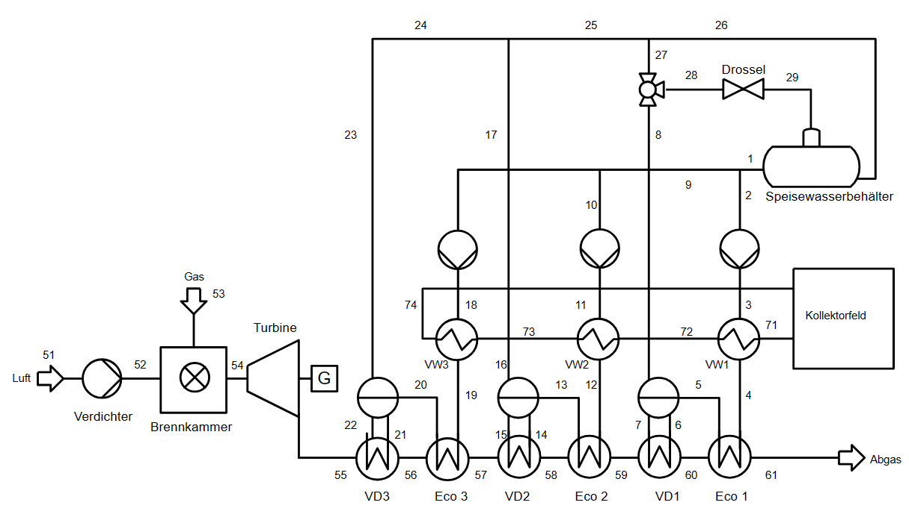

<!-- <!DOCTYPE html> -->
<html lang="de">
<head>
    <meta charset="UTF-8">
    <meta name="viewport" content="width=device-width, initial-scale=1.0">
    <title>Gruppenarbeit Gruppe-4</title>
    <!-- Verknüpfung mit der CSS-Datei -->
    <link rel="stylesheet" href="styles.css">

</head>
<body>
    <!-- Kopfbereich der Webseite -->
    <header>
        

            <h1>Gruppenarbeit Gruppe-4 </h1>
            <!-- Navigationsleiste -->
            <nav>
                <ul>
                    <li><a href="#einleitung">Einleitung und Aufgabenstellung</a></li>
                    <li><a href="#modell">Aufbau des Modells</a></li>
                    <li><a href="#ergebnisse">Ergebnisse</a></li>
                    <li><a href="#ausblick">Ausblick</a></li>
                </ul>
            </nav>
        

    </header>

    <!-- Hauptinhalt -->
    

        <!-- Einleitungsbereich -->
        <section id="einleitung">
            <h2>Einleitung und Aufgabenstellung</h2>
            
Im Rahmen des Moduls „Vertiefendes Rechnerpraktikum zur Energietechnik“ besteht das Ziel darin, einen industriellen Dampferzeugungsprozess zu entwerfen, zu modellieren und zu simulieren. Hierfür kommen die Programme <em>TESPy</em> und <em>Ebsilon</em> zum Einsatz.

            
Die Grundvariante des modellierten Dampferzeugers verwendet Erdgas, das in einer Brennkammer verbrannt wird, um die erforderlichen Dampfstufen zu erreichen. Eine Gasturbine ist zwischen der Brennkammer und dem Wärmetauscher positioniert, um elektrische Energie zu generieren, um die hohe Abgastemperatur effektiv zu nutzen. In weiterführenden Modellen erfolgt die Untersuchung der Integration einer Wärmepumpe sowie solarthermischer Energie. Dabei wird erörtert, inwieweit diese Integrationen eine sinnvolle Maßnahme zur Reduzierung des CO&#8322;-Ausstoßes darstellen können.

            
        </section>

        <!-- Aufbau des Modells -->
        <section id="modell">
            <h2>Aufbau des Modells</h2>
           
           

Für das Grundmodell mit ausschließlicher Erdgasverbrennung wird eine schematische Darstellung in Abbildung 1 gezeigt. Der dargestellte Aufbau dient als Orientierung für die Modellierung. Bei der Verwendung von <em>Ebsilon Professional</em> wird dieser Aufbau übernommen, da das Programm primär eine grafische Benutzeroberfläche für die Modellerstellung bietet. Um das Modell zu vervollständigen, sind die Ergänzung von Reglern und die Festlegung von Startwerten notwendig. Dies ermöglicht die Realisierung eines voll funktionsfähigen Modells für die Berechnung des Gasverbrauchs. 

  <figcaption class="caption-class">Abbildung 1: Fließbild für das Modell 1 mit reiner Erdgasverbrennung.</figcaption> 
 

   <!-- Absatnd zum Text unten -->
 

Auf der anderen Seite wiederum steht das Modell in <em>TESPy</em> (<em>engl.: Thermal Engineering Systems in Python</em>), eine leistungsfähige Bibliothek zur Simulation thermodynamischer Kreisprozesse, die speziell für die Anwendung in Python entwickelt wurde. Mit ihr können Nutzer komplexe thermische Anlagen, wie Dampferzeuger, durch die Definition einzelner Komponenten und deren Verbindungen präzise modellieren. Diese Modellierungsfähigkeit macht <em>TESPy</em> besonders wertvoll für die Entwicklung und das Design von Dampferzeugersystemen, indem es ermöglicht, verschiedene Konfigurationen und Betriebsbedingungen effizient zu simulieren und zu bewerten.

Um zu erkennen ob zumindest theoretisch der Erdgasverbrauch reduziert werden kann, werden zwei weitere Modelle entwickelt. Diese basieren auf dem Modell mit reiner Erdgasverbrennung. In <em> Modell 2</em> wird eine Solarthermie integriert. Dieser solarthermische Kreislauf fördert 500 t/h, bei 300 °C und 10 bar Thermoöl und entspricht etwa 41 MWh thermische Energie. In Abbildung 2 ist die Integration der Solarthermie als Fließbild  dargestellt.

  <figcaption class="caption-class">Abbildung 2: Fließbild mit Solarthermie zuschaltung.</figcaption> 

 Im letzten Modell kommt anstelle der Solarthermie eine Wärmepumpe zum Einsatz. Diese Variante wird in Abbildung 3 dargestellt. Für dieses Modell wird eine Wärmepumpe vom Typ Large Heat Pumps (LHP) der Firma Turboden S.p.A. verwendet. Die LHP-Technologie von Turboden, die durch mechanische Dampfkompression (<em>englisch: Mechanical Vapor Recompression</em>, MVR) ergänzt wird, stellt eine effiziente Lösung für großskalige Heizanwendungen dar, einschließlich der Produktion von überhitztem Dampf.
Diese LHP generiert bei 250 °C und 10 bar etwa 40 MWh an thermischer Energie. 
 

  <figcaption class="caption-class">Abbildung 3: Fließbild mit zusätzlicher Wärmepumpe.</figcaption>

            
            <!-- Tabelle 1: Zielwerte -->
            
Die Zielwerte für das Modell sind in Tabelle 1 dargestellt. Es ist hervorzuheben, dass diese Zielwerte in den konzipierten Modellen konsistent erreicht werden.

            <table id="tabelle-zielwerte">
  <caption>Tabelle 1: Zielwerte</caption>
  <thead>
    <tr>
      <th>Parameter</th>
      <th>Symbol</th>
      <th>Wert</th>
    </tr>
  </thead>
  <tbody>
    <tr>
      <td>Hochdruckdampf</td>
      <td>pH; m&#775;</td>
      <td>40 bar; 90 t/h</td>
    </tr>
    <tr>
      <td>Mitteldruckdampf</td>
      <td>pM; m&#775;</td>
      <td>14 bar; 360 t/h</td>
    </tr>
    <tr>
      <td>Niederdruckdampf</td>
      <td>pN; m&#775;</td>
      <td>4 bar; 900 t/h</td>
    </tr>
  </tbody>
</table>

           <!-- Tabelle 2 -->

Die Ausgangswerte für den Prozess sind in Tabelle 2 dargestellt.

<table id="tabelle-ausgangswerte">
    <caption>Tabelle 2: Ausgangswerte</caption>
  <thead>
    <tr>
      <th>Parameter</th>
      <th>Symbol</th>
      <th>Wert</th>
    </tr>
  </thead>
  <tbody>
    <tr>
      <td>Druckverlust</td>
      <td>pDV</td>
      <td>1 bar</td>
    </tr>
    <tr>
      <td>Erdgas</td>
      <td>pEG; TEG</td>
      <td>30 bar; 15 °C</td>
    </tr>
    <tr>
      <td>Luft</td>
      <td>pLuft; Tluft</td>
      <td>1 bar; 15 °C</td>
    </tr>
    <tr>
      <td>Lambda</td>
      <td>λ</td>
      <td>-</td>
    </tr>
    <tr>
      <td>Luftzusammensetzung</td>
      <td>x</td>
      <td>N2: 0,79; O2: 0,21</td>
    </tr>
  </tbody>
</table>

<!-- Tabelle 3 -->

In Tabelle 3 sind die Rahmenbedingungen für die Gasturbine aufgeführt.

<table id="tabelle-gasturbine">
    <caption>Tabelle 3: Gasturbinen</caption>
    <thead>
        <tr>
            <th>Parameter</th>
            <th>Symbol</th>
            <th>Wert</th>
        </tr>
    </thead>
    <tbody>
        <tr>
            <td>isentroper Verdichterwirkungsgrad</td>
            <td>&eta;is,Verdichter</td>
            <td>90%</td>
        </tr>
        <tr>
            <td>maximale Feuerungstemperatur</td>
            <td>Tmax_BK</td>
            <td>1600 °C</td>
        </tr>
        <tr>
            <td>isentroper Expanderwirkungsgrad</td>
            <td>&eta;is,Expander</td>
            <td>90%</td>
        </tr>
        <tr>
            <td>mechanischer Wirkungsgrad</td>
            <td>&eta;m</td>
            <td>99%</td>
        </tr>
    </tbody>
</table>

<!-- Tabelle 4 -->

In Tabelle 4 sind die Rahmenbedinungen für die Pumpen aufgeführt, die in den Modellen verwendet werden.

<table id="tabelle-pumpen">
    <caption>Tabelle 4: Pumpen</caption>
    <thead>
        <tr>
            <th>Parameter</th>
            <th>Symbol</th>
            <th>Wert</th>
        </tr>
    </thead>
    <tbody>
        <tr>
            <td>isentroper Wirkungsgrad</td>
            <td>&eta;is</td>
            <td>80%</td>
        </tr>
        <tr>
            <td>mechanischer Wirkungsgrad</td>
            <td>&eta;m</td>
            <td>99%</td>
        </tr>
    </tbody>
</table>

<!-- Tabelle 5 -->

Der mechanisch-elektrischer Wirkungsgrad sowie der rein mechanische Wirkungsgrad ist für den Generator in Tabelle 5 aufgeführt.

<table id="tabelle-generatoren">
    <caption>Tabelle 5: Generatoren</caption>
    <thead>
        <tr>
            <th>Parameter</th>
            <th>Symbol</th>
            <th>Wert</th>
        </tr>
    </thead>
    <tbody>
        <tr>
            <td>mechanisch-elektrischer Wirkungsgrad</td>
            <td>&eta;m-el</td>
            <td>98,50%</td>
        </tr>
        <tr>
            <td>mechanischer Wirkungsgrad</td>
            <td>&eta;m</td>
            <td>100%</td>
        </tr>
    </tbody>
</table>     

        <!-- Ergebnisse -->
        <section id="ergebnisse">
            <h2>Ergebnisse</h2>
            
 Die in Tabelle 6 dargestellten Ergebnisse offenbaren eine erhebliche Diskrepanz zwischen den verwendeten Modellen. Besonders auffällig ist, dass der Gasverbrauch im <em>TESPy</em>-Modell signifikant niedriger ausfällt als im <em>Ebsilon</em>-Modell. Zudem weist die Auswirkung der Vorwärmung in den beiden Modellen entgegengesetzte Tendenzen auf: Während der Gasverbrauch im <em>Ebsilon</em>-Modell durch die Vorwärmung ansteigt, führt sie im <em>TESPy</em>-Modell zu einer Reduktion des Verbrauchs. Dies unterstreicht die Bedeutung der Modellwahl und der spezifischen Konfiguration der Systemkomponenten für die Genauigkeit und Effizienz der Simulationen in der thermodynamischen Analyse.  

           
<!-- Tabelle 6 -->

    <!-- Ebsilon Tabelle -->
    

        <table>
            <caption>Tabelle 6: Zielwerte Vergleichen (Ebsilon)</caption>
            <thead>
                <tr>
                    <th>Stoff</th>
                    <th>Ergebnis</th>
                    <th>Einheit</th>
                </tr>
            </thead>
            <tbody>
                <tr>
                    <td>Gas CH4</td>
                    <td>69,3</td>
                    <td>kg/s</td>
                </tr>
                <tr>
                    <td>Modell 2 (Gas + ST)</td>
                    <td>70,66</td>
                    <td>kg/s</td>
                </tr>
                <tr>
                    <td>Modell 3 (Gas + WP)</td>
                    <td>71,69</td>
                    <td>kg/s</td>
                </tr>
            </tbody>
        </table>
    

    
    <!-- TESPy Tabelle -->
    

        <table>
            <caption>(TESPy)</caption>
            <thead>
                <tr>
                    <th>Stoff</th>
                    <th>Ergebnis</th>
                    <th>Einheit</th>
                </tr>
            </thead>
            <tbody>
                <tr>
                    <td>Gas CH4</td>
                    <td>42,98</td>
                    <td>kg/s</td>
                </tr>
                <tr>
                    <td>Modell 2 (Gas + ST)</td>
                    <td>41,39</td>
                    <td>kg/s</td>
                </tr>
                <tr>
                    <td>Modell 3 (Gas + WP)</td>
                    <td>41,44</td>
                    <td>kg/s</td>
                </tr>
            </tbody>
        </table>
    

Es ist jedoch zu betonen, dass die Änderungen im Gasverbrauch bei beiden Programmen gering ist und sich auf etwa 1,5 kg/s belaufen. Der festgestellte Unterschied lässt sich möglicherweise darauf zurückführen, dass im <em>Ebsilon</em>-Modell für die reine Gasverbrennung ohne Vorwärmung ein Verdampfer eingesetzt wurde, während bei den Modellen mit Vorwärmung auf einfache Wärmetauscher zurückgegriffen wurde. Diese sind im Vergleich zu einem klassischen Verdampfer für den Verdampfungsprozess weniger effizient, was zu einem höheren Gasverbrauch in den Ebsilon-Modellen trotz Vorwärmung führen kann. Hier ist zu erwähnen, dass das Modell von <em>TESPy</em> einen signifikant geringeren Gasverbrauch aufweist, welcher um circa 62 % niedriger liegt als der von <em>Ebsilon</em> ermittelte Verbrauch.            
            

 Dieser markante Unterschied in den Resultaten lässt sich, trotz gleicher Anfangswerte nicht ausschließlich durch die Verwendung unterschiedlicher Rechenmodelle und Stoffwertbibliotheken erklären. Mögliche Gründe für diese Diskrepanz könnte ein anderer Aufbau des Modells zwischen einander sein oder eventuell in einer fehlerhaften Definition einer Komponente liegen. Eine weitere mögliche Ursache für die Abweichungen im theoretischen Gasverbrauch könnte in einer suboptimalen Steuerung liegen oder daraus resultieren, dass der Kreislauf in <em>Ebsilon Professional</em> nicht fehlerfrei geschlossen wurde.

            
        </section>

        <!-- Ausblick -->
        <section id="ausblick">
            <h2>Ausblick</h2>
            
 Die durchgeführte Aufgabe wurde erfolgreich abgeschlossen. Sämtliche Ziele, einschließlich der Entwicklung, Modellierung und Simulation eines industriellen Dampferzeugungsprozesses, wurden erfüllt. In diesem Kontext erfolgte eine detaillierte Untersuchung der Auswirkungen, die die Integration einer Wärmepumpe oder Solarthermie auf den Verbrauch von Gas hat. 

 Um den Zeitaufwand zu optimieren, wurden die Modelle partiell vereinfacht. Dies umfasst auch, dass die Modelle in <em>TESPy</em> derzeit noch offen konzipiert sind. Zukünftige Anpassungen könnten vorsehen, dass diese Modelle zu einem vollständigen Kreislauf geschlossen werden.

 Eine weitere sinnvolle Untersuchung könnte die Evaluierung der Gasersparnisse sein, die durch den Verzicht auf die Vorwärmung mittels einer alternativen Wärmequelle und stattdessen durch die vollständige Verdampfung in einem der drei Dampfkreisläufe erzielt werden kann. Eine solche Konfiguration könnte potenziell zu deutlich höheren Einsparungen führen. Dies liegt daran, dass die Erwärmung von Wasser bis knapp unter seinen Siedepunkt relativ wenig Energie verbraucht im Vergleich zur Energiemenge, die für die Phasenänderung des Wassers von flüssig zu gasförmig benötigt wird. Die Verdampfungswärme, also die Energie, die erforderlich ist, um Wasser bei konstanter Temperatur und Druck zu verdampfen, stellt einen signifikanten Anteil des Gesamtenergiebedarfs im Prozess der Dampferzeugung dar. 

           

Für die Zukunft könnten weitere Integrationen moderner und erneuerbarer Technologien modelliert werden, um einen industriellen Dampferzeugungsprozess zu entwerfen, der unabhängig von fossilen Brennstoffen ist. In den bereits erstellten Modellen sind einige Vereinfachungen vorgenommen worden, wie die Annahme einer konstanten Umgebungs-, Kühlwasser- und Erdgastemperatur sowie die Annahme, dass immer ein konstanter Abnehmer des produzierten Dampfes vorhanden ist. Eine dynamische Betrachtung könnte hier zu realistischeren Ergebnissen führen.

     
    

    <!-- Fußbereich -->
    <footer>
        

            
Gruppenarbeit Gruppe-4 © 2024

            
Kontakt: kaya.davy.halbleib@tu‐berlin.de

             
alexbreousch@gmail.com

             
huangkuanhsiang@gmail.com

        

    </footer>
<!-- </body> 
</html> -->

